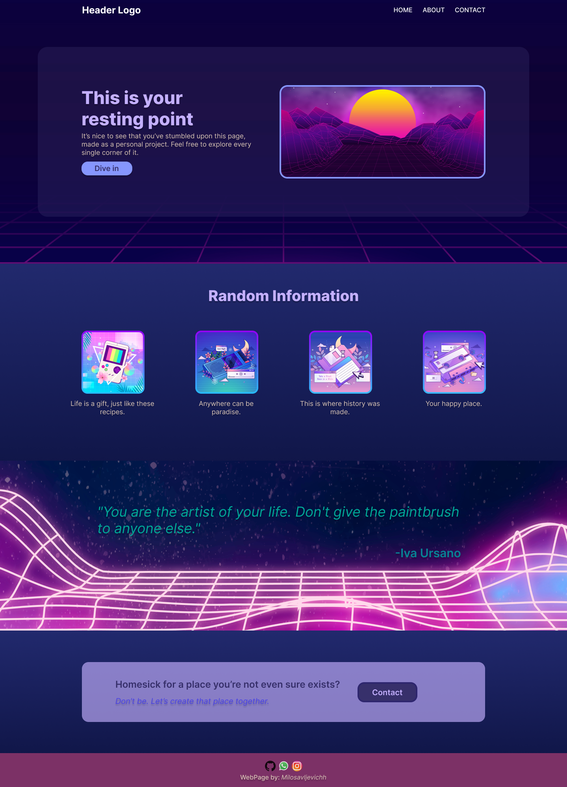

# landing_page
The "Landing Page Project" made for "The Odin Project".
The web page was created by me, while the design was provided by "The Odin Project".

# The design that was supposed to be created:

#Same design but modified for my personal needs:

pictures on the webPage taken from: 
Image by <a href="https://www.freepik.com/free-photo/retro-3d-shapes-vaporwave-style_14568076.htm#page=2&query=vaporwave&position=47&from_view=keyword&track=sph">Freepik</a>
<a href="https://www.freepik.com/free-vector/linear-gradient-vintage-cassette_13405021.htm#from_view=detail_alsolike">Image by pikisuperstar</a> on Freepik
<a href="https://www.freepik.com/free-vector/linear-vintage-vaporwave-background_12893044.htm#query=vaporwave&position=1&from_view=keyword&track=sph">Image by pikisuperstar</a> on Freepik
Image by <a href="https://www.freepik.com/free-vector/futuristic-landscape-background-retro-style_5192559.htm#from_view=detail_alsolike">Freepik</a>
<a href="https://www.freepik.com/free-vector/neon-grid-background_4394259.htm#query=vaporwave&position=0&from_view=keyword&track=sph">Image by rawpixel.com</a> on Freepik
Image by <a href="https://www.freepik.com/free-vector/vintage-vaporwave-background_12980787.htm#page=6&query=vaporwave%20icons&position=8&from_view=search&track=ais">Freepik</a>
<a href="https://www.freepik.com/free-vector/linear-gradient-retro-cassette_13405019.htm#query=vaporwave%20icons&position=21&from_view=search&track=ais">Image by pikisuperstar</a> on Freepik
<a href="https://www.freepik.com/free-vector/neon-synthwave-background-with-design-space_14549261.htm#page=9&query=vaporwave%20icons&position=2&from_view=search&track=ais">Image by rawpixel.com</a> on Freepik